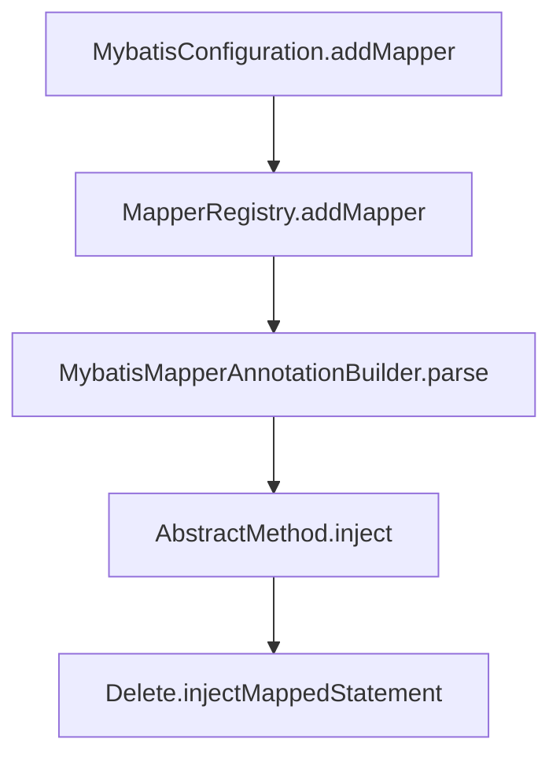

#Mybatis-plus #SourceCode #Mybatis  

# BaseMapper 实现源码

## SQL定义

在BaseMapper中只是定义了CRUD的接口，没有具体的实现。
具体的实现为SQL语句，SQL语句定义在 mybatis-plus-core jar中 mybatisplus.core.enums包的 SQLMethod类中，作为enum列举了基础的CRUD操作的SQL语句。
如下有 deleted_by_id 的SQL语句：

```java
DELETE_BY_ID("deleteById", "根据ID 删除一条数据", "<script>\nDELETE FROM %s WHERE %s=#{%s}\n</script>"),
```

具体参数含义如下：

```java
SqlMethod(String method, String desc, String sql)
```

- method 方法签名
- desc 方法描述
- sql 具体SQL语句。

## 获取method的调用
跟踪  ```getMethod()``` 方法调用可看到，调用者有

1. AbstractMethod：抽象的注入方法类，用于初始化时想向mapper自动注入方法。
2. Model\<T extends Model\<?\>\> ：*ActiveRecord* 模式，AR模式下实体即可调用相应的CRUD操作方法。AR使用的**前提**是：必须存在对应的原始mapper并继承**baseMapper**并且可以使用。因为实际上还是调用BaseMapper的方法。
3. ServiceImpl\<M extends BaseMapper\<T\>, T\> implements IService\<T\>  存在于 mybatis-plus-extension jar中提供的 **通用 Service CRUD 封装接口 IService的实现**

以上调用的目的是 **获取CRUD方法的命名空间（mapper的全限定名，签名）** 以便于在特定mapper上执行方法。

##  获取SQL的调用

获取SQL的调用 ```getsql``` 主要发生在 **(注入)生成 MappedStatement** 时，mybatis-plus-core 的 injector.method中。

如下 delete 中

```java
public class Delete extends AbstractMethod {
    @Override
    public MappedStatement injectMappedStatement(Class<?> mapperClass, Class<?> modelClass, TableInfo tableInfo) {
        String sql;
        SqlMethod sqlMethod = SqlMethod.LOGIC_DELETE;
        if (tableInfo.isWithLogicDelete()) {
            sql = String.format(sqlMethod.getSql(), tableInfo.getTableName(), sqlLogicSet(tableInfo),
                sqlWhereEntityWrapper(true, tableInfo),
                sqlComment());
            SqlSource sqlSource = languageDriver.createSqlSource(configuration, sql, modelClass);
            return addUpdateMappedStatement(mapperClass, modelClass, getMethod(sqlMethod), sqlSource);
        } else {
            sqlMethod = SqlMethod.DELETE;
            sql = String.format(sqlMethod.getSql(), tableInfo.getTableName(),
                sqlWhereEntityWrapper(true, tableInfo),
                sqlComment());
            SqlSource sqlSource = languageDriver.createSqlSource(configuration, sql, modelClass);
            return this.addDeleteMappedStatement(mapperClass, getMethod(sqlMethod), sqlSource);
        }
    }
}
```

调用链如下：



MybatisConfiguration 的初始化 是从 **MybatisXMLConfigBuilder** 构造 （这里使用自己的 **MybatisConfiguration 而不是 mybatis 包中的 Configuration**）

# 总结

- **以上调用链的流程符合 《Mybatis原理》一文中所述: 从文件中读取属性-->加载xml文件-->加载DataSource-->加载Mapper文件 注册Mapper**

- **BaseMapper 的CRUD方法的SQL注入是在初始化的时候完成的** 