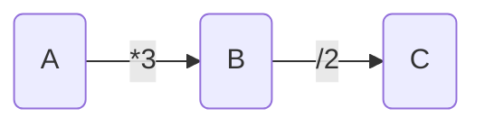

#Stream #Java基础 

# 数学概念-范畴（Category Theory）
- 数据概念帮助理解一些问题出现的原因与原理：函数式编程的数学**起源就是范畴概念**。
- 范畴就是使用 **“箭头”连接的“物体”**。
- 物体表示的是**可以转化的实体**，而箭头是物体的**互相转化“关系”**：
	- 举个例子来说，如果 A 可以通过`*3`变换转化为 B，而 B 可以通过`/2`变成 C：

- A、B、C 与两个箭头共同构成了一个范畴。
- A、B、C 间箭头的这种转化关系的学名被称为"态射"（morphism），B 与 C 因为都是可以从 A 通过一个或者多个态射转化而来的，所以认为B 、C是 A 的不同状态的"变形"（transformation）。
- 范畴包含两个部分：
	1. 让不同实体互相转化的“态射”集合；
	2. 可以从某一实体“变形”的实体集合；
	3. 范畴中的 **“态射”便是“函数”概念**。
	4. 函数式编程则是在计算机中通过函数接口的方式描述实体间的转化，从而获得另一个“变形”（transformation）：
	5. 函数式编程实际上是用**编程的方式在对象间进行“变形”（transformation）的一种数学运算**。
- 那么就可以理解关于函数式接口中很多定义:
	1. 函数式接口中之*应有一个方法*。因为是为了**表示一个映射关系**。
	2. 函数式接口方法**不能有额外副作用**。函数*只进行实体的转换*，而非其他其他应用逻辑。

# 函数式接口
- 由于函数是用来描述一次实体的转变的，所以**函数式接口中只有一个抽象方法**。
-  Java 的继承关系，”只有一个“的概念实际是排除了 Object 的相关方法的。
- 满足这个条件的就可以作为函数式接口，但为了语义清晰，可用 `@FunctionInterface` 注解标记到接口上，用于表明这个接口只应该有一个抽象方法，如果不满足这个条件，则会在编译的时候就暴露出来。
- 尽管 Java 的函数式编程是在 Java8 才支持的，但是之前的版本中就有很多函数接口，其中常用的有:
	-   java.lang.Runnable
	-   java.util.concurrent.Callable
	-   java.util.Comparator
	-   java.io.FileFilter
	-   java.nio.file.PathMatcher

# Java8 新增的函数式接口
- 在 Java8 中为了支持 Lambda 表达式与函数式编程，特别新增了一批函数式接口，包路径为: `java.util.function`  
该包路径下一共 43 个类，划分为以下几类:
-   基础类型 4 种
-   入参扩展 3 种
-   出入类型相同省略 2 种
-   基础类型扩展 34 种

## 基础类型
- 基础类型定义有以下几种:
	- Predicate
	- Supplier：提供者，**范畴实体的开始(supplier)**；
	- Function：转换者，**范畴实体与实体的态射(function)**；
	- Consumer：消费者，**范畴实体的结束(consumer)**。
- 其他的定义都是围绕在这些概念的基础上进行扩展的。
- Predicate 可以算是 Function 的一种*特例变形*，可以认为是 Function<T,Boolean>。
	- 单独进行封装是为了进行语义增强。
	- 源码上的说明也是如此:  `Represents a predicate (boolean-valued function) of one argument`.

## 入参扩展
入参扩展就是将具有入参的基本类型的*参数个数扩展为两个*：
-   BiConsumer
-   BiFunction
-   BiPredicate
- 原则上，多参数的扩展是可以利用“科尔化”来处理的；
- 但是两个参数的使用场景实在是太多了，比如处理 Map 相关的内容，所以将两个入参的封装为了单独的接口。

## 出入类型相同省略

- *出入类型相同省略*是对 Function 与 BiFunction 的一种特殊的省略。
- 由于在数据处理的时候存在大量使用相同数据类型进行处理的情况，例如: reduce 操作。所以特别地提供了入参与出参相同的接口:
	-  **UnaryOperator(单个入参)**
	-  **BinaryOperator(两个入参)**
- 出入参数类型相同，则可以简化泛型定义的过程。

## 基础类型扩展
- 主要针对常用的基础类型 int、long、double 类型进行了接口定义扩展，三种类型各 11 个，以 Int 为例子:
	-   IntBinaryOperator
	-   IntConsumer
	-   IntFunction
	-   IntPredicate
	-   IntSupplier
	-   IntUnaryOperator
	-   ObjIntConsumer
	-   IntToDoubleFunction
	-   IntToLongFunction
	-   ToIntBiFunction
	-   ToIntFunction
可以看到这 11 个接口又可以分为三种：
-   **入参推定**，对于一种入参类型的接口，入参类型都是 `int`。
	- Int 开头的接口(不包含 IntTo)。
	- ObjIntConsumer 是一个入参为`int`的 BiConsumer。
-   **类型转换**Function:
	- 向其他基础类型进行转换的 Function;
	- 是 IntTo 开头的接口;
-   **出参推定**，对于出参的接口，出参类型都是 `int`。
	- ToInt 开头的接口。
- boolean 类型单独提供了 BooleanSupplier 接口。
- 基础类型扩展主要是避免在处理常用类型的函数式编程或者流编程的时候**产生频繁的包装类转换**。
- 单独提供了一组接口，用于提高性能。

# 最后
- Java8 中的函数式编程是一种数学思想的程序化，而函数接口则是具体的执行单位。函数式接口以 Consumer、Supplier、Function 三个借口为核心进行功能扩展，以满足不同场景的便捷使用。

# reduce
-   `Reduce` 原意：减少，缩小
-   根据指定的计算模型将Stream中的值计算得到一个最终结果  ：
	- `reduce` 操作可以实现从Stream中生成一个值;
	- 其生成的值不是随意的，而是根据指定的计算模型。
	- 比如，之前提到 count、min和max事实上都是reduce操作，因为常用而被纳入标准库中。
# 参考
1. [JAVA8 Stream流之reduce()方法详解](https://www.cnblogs.com/MrYuChen-Blog/p/14061320.html)
2. [JAVA新特性的入场券-函数式接口](https://xie.infoq.cn/article/a8ef07f9558032814ce169588)