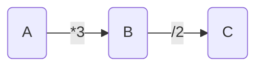

#Stream #Java基础 

# 数学概念-范畴（Category Theory）
- 数据概念帮助理解一些问题出现的原因与原理：函数式编程的数学**起源就是范畴概念**。
- 范畴就是使用 **“箭头”连接的“物体”**。
- 物体表示的是**可以转化的实体**，而箭头是物体的**互相转化“关系”**：
	- 举个例子来说，如果 A 可以通过`*3`变换转化为 B，而 B 可以通过`/2`变成 C：

- A、B、C 与两个箭头共同构成了一个范畴。
- A、B、C 间箭头的这种转化关系的学名被称为"态射"（morphism），B 与 C 因为都是可以从 A 通过一个或者多个态射转化而来的，所以认为B 、C是 A 的不同状态的"变形"（transformation）。
- 范畴包含两个部分：
	1. 让不同实体互相转化的“态射”集合；
	2. 可以从某一实体“变形”的实体集合；
	3. 范畴中的 **“态射”便是“函数”概念**。
	4. 函数式编程则是在计算机中通过函数接口的方式描述实体间的转化，从而获得另一个“变形”（transformation）：
	5. 函数式编程实际上是用**编程的方式在对象间进行“变形”（transformation）的一种数学运算**。
- 那么就可以理解关于函数式接口中很多定义:
	1. 函数式接口中之*应有一个方法*。因为是为了**表示一个映射关系**。
	2. 函数式接口方法**不能有额外副作用**。函数*只进行实体的转换*，而非其他其他应用逻辑。

# 函数式接口
- 由于函数是用来描述一次实体的转变的，所以**函数式接口中只有一个抽象方法**。
-   Java 的继承关系，这个”只有一个“的概念实际是是排除了 Object 的相关方法的。

满足这个条件的就可以作为函数式接口进行使用，但为了后续的开发导致歧义，你可以用`@FunctionInterface`注解标记到接口上，用于表明这个接口只应该有一个抽象方法，如果不满足这个条件，则这个问题会在编译的时候就暴露出来。

  

尽管 Java 的函数式编程是在 Java8 才支持的，但是之前的版本中就有很多函数接口，其中常用的有:

  

-   java.lang.Runnable
    
-   java.util.concurrent.Callable
    
-   java.util.Comparator
    
-   java.io.FileFilter
    
-   java.nio.file.PathMatcher
    

  

这些接口本身就满足上述条件，同时在 Java8 中也为这些接口加上了`@FunctionInterface`注解特别标示。
# reduce
-   `Reduce` 原意：减少，缩小
-   根据指定的计算模型将Stream中的值计算得到一个最终结果  ：
	- `reduce` 操作可以实现从Stream中生成一个值;
	- 其生成的值不是随意的，而是根据指定的计算模型。
	- 比如，之前提到 count、min和max事实上都是reduce操作，因为常用而被纳入标准库中。
# 参考
1. [JAVA8 Stream流之reduce()方法详解](https://www.cnblogs.com/MrYuChen-Blog/p/14061320.html)
2. [JAVA新特性的入场券-函数式接口](https://xie.infoq.cn/article/a8ef07f9558032814ce169588)